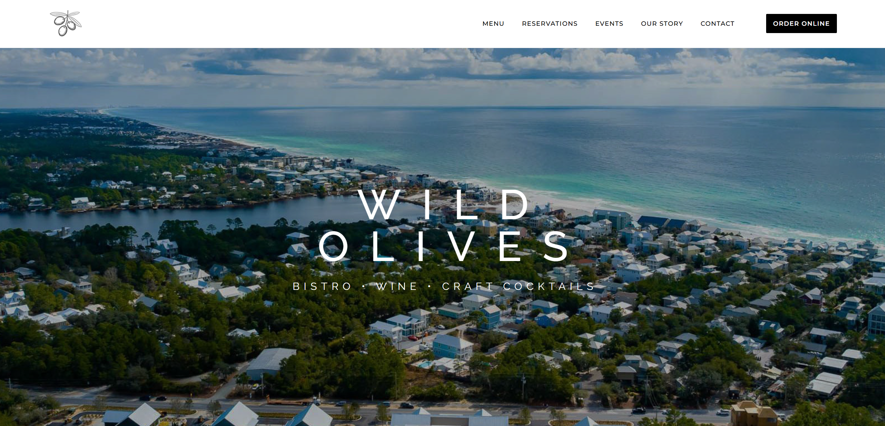

# Wild Olives Website (React Rebuild)

## Overview

Wild Olives is a modern rebuild of the Wild Olives restaurant website originally implemented on Wix. The goal of this project was to recreate the site as a maintainable, component-driven React application while preserving the visual structure and content of the original site.

The application is built as a single-page React application using Vite and Tailwind CSS, with client-side routing handled by React Router. The frontend architecture emphasizes reusable layout primitives, composable section components, and responsive behavior across mobile and desktop devices.

The finished site is deployed as a static application using Amazon S3 and CloudFront. The infrastructure intentionally remains minimal, avoiding any backend services or server-side runtime, and focuses on clean static hosting architecture suitable for modern frontend deployments.

This project demonstrates frontend architecture design, component-driven UI development, responsive layout engineering, and cost-efficient AWS static hosting.

---

## Live Preview

Production URL:

https://d6uiwxps2u5ue.cloudfront.net

<p align="center">
  
</p>

---

## Architecture Summary

### Frontend

- React
- React Router DOM
- Tailwind CSS
- Vite build system
- Component-driven UI architecture
- Client-side SPA routing

The application is structured as a single-page application with route-based page rendering.

Pages include:

- Home
- Menu
- Reservations
- Events
- Our Story
- Contact
- Private Events
- Careers
- Menu subpages (Dinner, Brunch, Wine, Cocktails, etc.)

Routing is handled entirely client-side using React Router.

---

## Component Architecture

The UI is organized into reusable component layers to reduce duplication and maintain consistent layout patterns.

### UI Primitives

Low-level reusable components used throughout the application:

- `Container`
- `Section`
- `Heading`
- `Divider`
- `ButtonLink`
- `ImageTile`
- `Grid`
- `HeroTitle`
- `PageHeroTitle`

These primitives standardize layout spacing, typography, and visual structure across all pages.

---

### Layout Components

Higher-level components provide flexible page structure.

#### SplitFeature

Two-column layout component used for storytelling sections.

Features:

- Side-by-side desktop layout
- Reversible layout
- Configurable mobile stacking
- Optional media hiding on mobile
- Flexible grid sizing

Used for:

- Story sections
- Event promotions
- Feature highlights

---

#### Gallery

Reusable image grid component supporting variable column layouts.

Features:

- Configurable row structures
- Responsive stacking behavior
- Fixed row heights on desktop
- Automatic height adjustment on mobile

---

#### SocialGrid

Specialized gallery component used for social-style image sections.

Includes:

- Section title
- Divider
- Configurable grid layout
- Optional external profile link

---

#### CenteredInfoBlock

Centered informational layout used for structured content sections.

Supports:

- Title and divider
- Centered text blocks
- Call-to-action buttons
- Flexible content slots

Used for:

- Contact page information
- Reservation instructions
- Event information blocks

---

### Banner System

Multiple banner components support hero sections and visual transitions across the site.

#### ParallaxBanner

Reusable full-width image banner supporting:

- Background images
- Overlay shading
- Optional parallax behavior
- Configurable height
- Custom child content

Parallax behavior is limited to desktop viewports to prevent rendering issues on mobile devices.

---

#### ContentBanner

A full-width background image section used between content blocks.

Supports:

- Configurable background positioning
- Overlay control
- Adjustable section height
- Optional mobile visibility control

---

#### LogoBanner

Brand-focused banner section used as a visual separator.

Features:

- Centered Wild Olives logo
- Optional custom content
- Consistent overlay styling

---

## Navigation System

### Desktop Navigation

The primary navigation bar uses React Router's `NavLink` to provide active route styling.

Features:

- Sticky header
- Active link highlighting
- Hover transitions
- Order Online call-to-action button

Primary navigation routes:

- Menu
- Reservations
- Events
- Our Story
- Contact
- Careers

---

### Mobile Navigation

A custom full-screen overlay navigation system was implemented for mobile devices.

Features include:

- Hamburger menu toggle
- Full-viewport overlay navigation
- Scroll locking while open
- Vertical navigation layout
- Accessible toggle controls

---

### Mobile Menu Dropdown System

The mobile navigation includes a nested dropdown system for menu pages.

The **Menu** item expands to reveal:

- Dinner
- Brunch
- Happy Hour
- Cocktails
- Wine
- Dessert

Behavior improvements include:

- Automatic dropdown expansion when opening the menu on `/menu/*` routes
- Dropdown indicator rotation when expanded
- Closing the mobile overlay when selecting submenu items

This improves usability when navigating between menu sections on small screens.

---

## Responsive Design Strategy

The site was built mobile-first using Tailwind's responsive utility system.

Key responsive behaviors include:

- Hero banners adapt to mobile viewport height
- Image galleries stack vertically on small screens
- SplitFeature layouts switch from stacked to two-column layouts
- Content banners can optionally hide large imagery on mobile
- Gallery rows adjust height dynamically on smaller devices

Special care was taken to address:

- mobile browser viewport height inconsistencies
- large image layout stability
- responsive navigation usability

---

## Image Handling

Images are stored locally within the project and imported directly into components.

Example directory structure:

```
src/assets/images/
```

This allows the Vite build system to:

- optimize assets
- hash filenames
- generate cache-friendly builds

A reusable `ImageTile` component standardizes image display behavior across galleries and feature layouts.

---

## Deployment Architecture

The site is deployed as a static frontend using AWS.

### Hosting

- Amazon S3 (private bucket)
- AWS CloudFront CDN

The build output generated by Vite (`dist/`) is uploaded to S3 and served through a CloudFront distribution.

CloudFront provides:

- global edge caching
- HTTPS delivery
- SPA routing fallback

---

## SPA Routing Support

Because the site uses client-side routing, CloudFront custom error responses are configured:

```
403 → /index.html
404 → /index.html
```

This ensures deep links such as:

```
/menu/dinner
/events
/private-events
```

load correctly even when accessed directly.

---

## Request Flow

```
Browser
   ↓
CloudFront CDN
   ↓
S3 Static Assets
   ↓
React SPA Router
```

All application logic runs in the browser after static assets are delivered.

No backend infrastructure is required.

---

## Key Engineering Decisions

### Component-Driven UI Architecture

The UI was intentionally structured around reusable components instead of page-specific markup.

Benefits:

- consistent layout patterns
- reduced duplication
- easier future expansion

This approach allows new pages to be built primarily through component composition.

---

### React + Vite Instead of Traditional Static HTML

The Wix site was rebuilt as a React SPA to provide:

- maintainable component architecture
- modern build tooling
- predictable routing behavior
- faster local development workflow

Vite was selected for its extremely fast development server and simple configuration.

---

### Tailwind Utility-First Styling

Tailwind CSS was used as the primary styling system.

Benefits include:

- consistent spacing system
- responsive utilities
- predictable styling patterns
- minimal custom CSS

---

### Static AWS Hosting

The site uses S3 + CloudFront instead of a server-based deployment.

Benefits:

- minimal operational overhead
- extremely low hosting cost
- globally cached content delivery
- simple deployment workflow

This architecture is well suited for static frontend applications.

---

## Operational Characteristics

- Static frontend deployment
- No backend runtime
- No database
- CloudFront CDN caching
- S3 origin storage
- HTTPS delivery via CloudFront

The infrastructure footprint is intentionally minimal and optimized for static content delivery.

---

## Intentional Limitations

- No server-side rendering
- No authentication layer
- No backend APIs
- No dynamic database content
- No CMS integration

These constraints reflect the scope of the original Wix site while maintaining a clean static architecture.

---

## What This Project Demonstrates

- React component architecture
- Tailwind responsive layout engineering
- Client-side routing with React Router
- Mobile navigation system design
- Reusable UI primitives and layout systems
- Static AWS deployment with S3 and CloudFront
- SPA routing configuration on CDN infrastructure

Wild Olives demonstrates how a traditionally hosted website can be rebuilt as a modern component-driven frontend application while maintaining minimal infrastructure and clean deployment architecture.